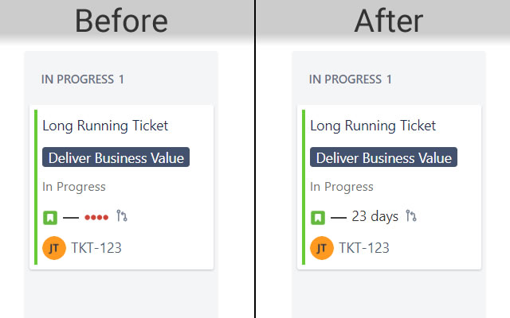

#  Jira Dots to Days

This extension replaces the `Days in column` dots indicator on Jira tickets with number of days as text making it easier to understand.

## Install

[**Chrome** extension](https://chrome.google.com/webstore/detail/jira-dots-to-days/dcanoegmldaongomhpnfmeejnpkebhmd)

## Contribution

Suggestions and pull requests are welcomed!.

---

This project was bootstrapped with [Chrome Extension CLI](https://github.com/dutiyesh/chrome-extension-cli)

